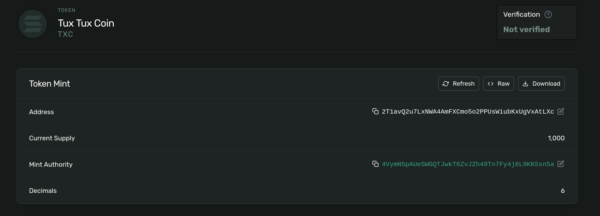
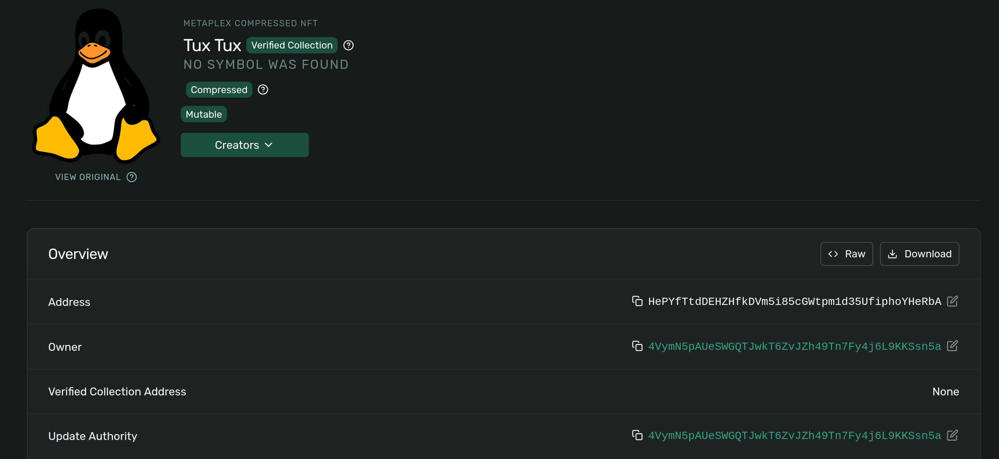

# SPL Token & NFT Logs

## SPL Token

### 1. Create Mint Account

```
Mint address: 2T1avQ2u7LxNWA4AmFXCmo5o2PPUsWiubKxUgVxAtLXc
Tx signature: 46v2XJJNKe9YzJGeGABNk1a3jvPH5av8mSxk2cE1dJeBXWLR9waWZnVPbSB9EwiRr9FUCfPNBMLMkdaReVGBHVvK
```

### 2. Attach Metadata

```
signature: 3iiCtTtsAbuDKd46E3iPcQYvvvMcrXJpUKjYwyHLiGuXEZA5rw7zyBRLFjUN6sB3pGvGvnjMRcMFvbWUMnsGPZp7
```

### 3. Create ATA & Mint Tokens

```
ATA: 2F78Qb5QGfQjyGEjJMtATFSTgvzsvZypy6udbyizFDrP
Tx signature: 3ygN8p6udP7L6P4AQaQDksSJsBEpSq9sBiauXqZzLNEMsrXW9zoBKAV1q3oXDRkynpKTnNADZWws6Y8r4stMeUUz
```

### 4. Transfer Tokens

```
From ATA: 2F78Qb5QGfQjyGEjJMtATFSTgvzsvZypy6udbyizFDrP
To ATA: 4caMt8mxBHo5fxzHxfds5Td3HTXByPuMNxy7xJbRj7e1
Tx signature: zhHR14u7STspQNTMxouSWSnsSuSxeML5EtDTCTQkX8iLvsrmYNHmN1dp3Eq5t5jgVyTZaEGDj3z2QCvAjKMc4tV
```



---

## NFT

### 1. Upload Image

```
Image URI: https://gateway.irys.xyz/oMKAcLb21uo64yZUQmBsrXd7KVfbsyiYME2rU1gHB3G
```

### 2. Upload Metadata

```
Metadata URI: https://gateway.irys.xyz/94RAp3gEMbGaijwogbYnV6fc2ac5T71AyxYhTbS7mnv1
```

### 3. Mint NFT

```
Signature: EZFuJW8bWva77y6jwZeqTpPvWPKHvVy2VR69eUdp3wYmxy3Dt6Fp2AHjHTThQ8qrhWjSfYYi5wEqEE7KKKZTji1
Asset: HePYfTtdDEHZHfkDVm5i85cGWtpm1d35UfiphoYHeRbA
```


